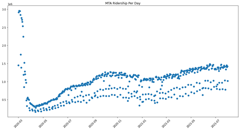

# Introduction

Under the long-lasting influence of the COVID-19 pandemic, the tradeoff between going outside and increasing COVID-19 cases became one of the major concerns among people. Therefore, we investigated the relationship between COVID-19 and transportation usage, specifically MTA (Metro) and FHV (For-Hire Vehicle), so that the commuters can travel safer and transportation authorities can plan more guidance for their passengers. With MapReduce and Hive, our project combined COVID-19 newly added positive cases with MTA and FHV ridership based on the date. Analyzing the combined data using Spark, we generally found a negative correlation between COVID-19 and MTA/FHV. However, the strength of the correlation varied – a strong correlation appeared from March 2020 to May 2020 but a weaker to none correlation afterward.

# Description of the MTA Dataset

The MTA Turnstile Dataset was provided by MTA Headquarters, New York City Transit (http://web.mta.info/developers/turnstile.html). The dataset was made of 96 ".txt" files that contained records from Jan 04, 2020, to Oct 30, 2021. Each record included a unique ID for every turnstile called SCP and the cumulative entry and exits register values for a device (turnstile) at a station at a specific time on a date. Usually, an audit event occurs six times a day, with the earliest at 03:00 and the latest at 23:00. It is also worth noting that the register value was initialized during system setup, which could occur for multiple reasons other than the turnstile's inception. For this paper, the authors used records from Mar 01, 2020, to July 31, 2021.

# Cleaning and Profiling

I first cleaned the MTA dataset using MapReduce. Specifically, I removed specific unwanted columns and kept SCP, station name, line name, date of the record, and the entry and exits register values. I noticed in the cleaning stage that the NYU HPC's version of Impala did not support the "date" data type. Therefore, I changed the date format from MM-DD-YYYY to YYYY-MM-DD so that the date could later be sorted using the "varchar" data type.

Next, I did serval grouping in Hive to find the total cumulative entry and exits by station and by date. Besides the cumulative values, I also needed to find the daily entry register values for a station on a day. To do this, I used the "LAG" function in SQL to retrieve the cumulative entry register value in the previous record and found the difference between the cumulative entry register value in the current record and the cumulative entry register value in the previous record.

After inspecting the daily entry register values for a station on a day, I found some abnormalities in the data: some entry register values were negative, and some entry register values were extremely large. After some validations and looking again at the documentation, I suspected that the re-initialization of the turnstiles caused the abnormal data, as, after each initialization, all or part of the register values would be erased. To remove the anomalous data, I employed John Tukey's outlier test with k=1.5.

After removing the outliers, I further grouped the data by station name to find the daily entry register values and used the daily entry register values to represent the MTA ridership for the day.

# Analysis

## Anlysis 1: General Observations of MTA Dataset Patterns and Trends

The figure below shows the distribution of MTA data from Mar 01, 2020, to July 31, 2021. I observed that the MTA ridership started to drop drastically since March 2020. The ridership reached a minimum in April 2020. Since then, the ridership began to recover and, finally, began to stabilize since October 2020.

## Anlysis 2: Which Day of the Week Has the Maximum/Minimum Ridership?

I picked three months since the MTA ridership had begun to stabilize: from Oct 2020 to Dec 2020. I found that in the total number of 14 weeks, the maximum ridership occurred on Tuesday and Wednesday both five times, and the minimum ridership occurred on Sunday 11 times. The statistics also validated the previous finding with the FHV dataset.

## Anlysis 3: Relationship Between Income Level and Changes in Ridership Before and After COVID-19 Outbreak

To investigate the effect of income level on the changes in ridership before and after the COVID-19 outbreak in NYC, I picked two subway stations: 72 ST from a neighborhood with relatively high income (Upper East Side) and 116 ST from a neighborhood with relatively low income (East Harlem). Calculations found that the average ridership for 72 ST in Jan 2020 (before the COVID-19 outbreak in NYC) was 22801 people per day, and the average ridership for 72 ST in Jan 2021 (almost a year after the COVID-19 outbreak in NYC) was 7681 people per day. The average ridership for 116 ST in Jan 2020 was 12637 people per day, and the number dropped to 4417 people per day after the outbreak. The ridership in both stations dropped 65% from the original level. Therefore, there were no significant differences in the changes in ridership in neighborhoods with different income levels.